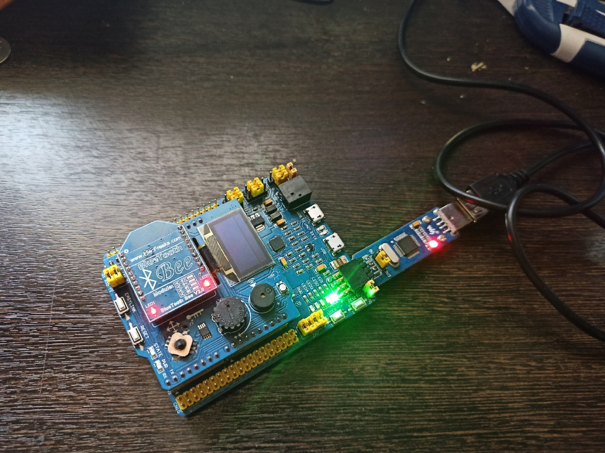

:figure-caption: Рисунок
:toc: Оглавление

= Лабораторная работа №1

== Задание к выполнению:
* Написать программу вычисляющую следующее выражение -3/3U *3 ,удивиться увиденному и объяснить результат.
* Подключить плату к своему домашнему компу, проверить что все работает, плата прошивается и все работает как в аптеке.
* Запустить на плате Lab1 из https://github.com/lamer0k/stm32Labs/tree/master/Lab1
добавить main код для зажигания светодиодов

[source, cpp, linenums]

----
 RCC::AHB1ENR::GPIOAEN::Enable::Set() ;
  GPIOA::MODER::MODER5::Output::Set() ;
  GPIOA::ODR::ODR5::High::Set() ;
----

* Не забыть подключить библиотеку для порта С

[source, cpp, linenums]

----
#include "gpioaregisters.hpp" //for Gpioa
----
* Пронаблюдать, что произошло на плате, все сфоткать.

* Сделать отчет с описание удивительных вещей из пункта а) и пошаговой работы с платой, с картинками, оглавлением, кодом и всяким модным и современным форматированием, чтобы отчет был читабельным и восхитительным. Описать ошибки которые вы получали при настройки, объяснить, что за ошибки, почему они возникли и как вы их исправили.

== Задание 1
=== Работа с программой

Была создана программа, которая вычисляет следующее выражение: -3/3U *3

.Прогорамма вычисления
[#img-sunset]
[link=https://github.com/MakarovSasha/Labs/blob/main/Lab2]
image::code%202021-09-30%20105650.png[Sunset,1040,285]

Как мы видем приобретенный итог не соответствует верному математическому. Впрочем итог -4 не считается случайным.

Комментарий приобретенного итога связанно со специфичностью работы компилятора. Например как U являеться указателем беззнакового количества, а количество -3 являеться знаковым. То при разделения беззнакового количества на знаковое применяется беззнаковая операция разделения. И лишь только при умножение на 3 применяется верное знаковое умножение.

== Задание 2
=== Проверка работоспособности платы

* Подключаем плату
* Настраиваем все в IAR, т.е. выбираем наше устройство

.Подключение платы
[#img-sunset]
[link=https://github.com/MakarovSasha/Labs/blob/main/Lab2]
image::check_1_%202021-09-30%20121318.png[Sunset,945,535]

.Настройка *IAR*
[#img-sunset]
[link=https://github.com/MakarovSasha/Labs/blob/main/Lab2]
image::check_2_2021-09-30%20122320.png[Sunset,661,553]

* Далее открываем проект lab1 и проверяем плату на прошиваемость

[source, cpp, linenums]

----
 #include "rccregisters.hpp" // for RCC
 std::uint32_t SystemCoreClock = 16'000'000U;
 extern "C" {
int __low_level_init(void)
{
//Switch on external 16 MHz oscillator
RCC::CR::HSION::On::Set();
while (RCC::CR::HSIRDY::NotReady::IsSet())
{
  }
  //Switch system clock on external oscillator
  RCC::CFGR::SW::Hsi::Set();
  while (!RCC::CFGR::SWS::Hsi::IsSet())
  {
  }
  RCC::APB2ENR::SYSCFGEN::Enable::Set();
  return 1;
}
}
int main()
{
  return 0;
}
----

* Следующим пунктом реализуем зажигание диода

[source, cpp, linenums]

----

 #include "rccregisters.hpp" // for RCC
 #include "gpioaregisters.hpp" //for Gpioa
 std::uint32_t SystemCoreClock = 16'000'000U;
 extern "C" {
int __low_level_init(void)
{
//Switch on external 16 MHz oscillator
 RCC::CR::HSION::On::Set();
while (RCC::CR::HSIRDY::NotReady::IsSet())
{
 }
//Switch system clock on external oscillator
RCC::CFGR::SW::Hsi::Set();
while (!RCC::CFGR::SWS::Hsi::IsSet())
{
 }
 RCC::APB2ENR::SYSCFGEN::Enable::Set();
 return 1;
 }
 }

 int main()
{
RCC::AHB1ENR::GPIOAEN::Enable::Set();
GPIOA::MODER::MODER5::Output::Set();
GPIOA::ODR::ODR5::High::Set();
 return 0;
}
----

Результатом представлен на фото ниже:

.Фото результата
[#img-sunset]
[link=https://github.com/MakarovSasha/Labs/blob/main/Lab2]
